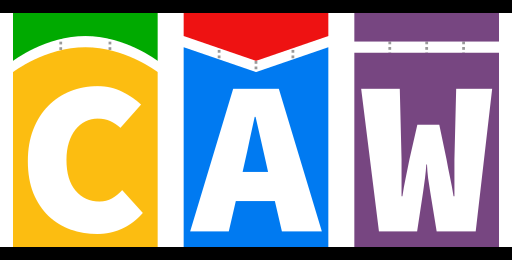

[][caw-site-link]

# Cancer Analysis Workflow

[![caw version][version-badge]][version-link] [![Licence][licence-badge]][licence-link] [![nextflow version][nextflow-badge]][nextflow-link] [![Join the chat at https://gitter.im/SciLifeLab/CAW][gitter-badge]][gitter-link]

CAW is a complete open source pipeline to detect somatic variants from WGS data developed at the [National Genomics Infastructure][ngi-link] at [SciLifeLab Stockholm][scilifelab-stockholm-link], Sweden.

The pipeline uses [Nextflow][nextflow-link], a bioinformatics domain specific language for workflow building.

This pipeline is primarily used with a SLURM cluster on the Swedish [UPPMAX systems](https://www.uppmax.uu.se/). However, the pipeline should be able to run on any system that Nextflow supports. We have done some limited testing using Docker, and the pipeline comes with some configuration for such system. See the [installation documentation](doc/INSTALL.md) for more information.

We utilize [GATK best practices](https://software.broadinstitute.org/gatk/best-practices/) to align, realign and recalibrate short-read data in parallel for both normal and tumor sample. After these preprocessing steps, several somatic variant callers scan the resulting BAM files: [MuTect1][mutect1-link], [MuTect2][gatk-link] and [Strelka][strelka-link] are used to find somatic SNVs and small indels, also [GATK HaplotyeCaller][gatk-link] for both the normal and the tumor sample. For structural variants we use [Manta][manta-link]. Furthermore, we are applying [ASCAT][ascat-link] to estimate sample heterogeneity, ploidy and CNVs.

The pipeline can begin the analysis either from raw FASTQ files, only from the realignment step, or directly with any subset of variant callers using recalibrated BAM files. At the end of the analysis the resulting VCF files are merged to facilitate further downstream processing, though results from each caller are also retained. The flow is capable of accommodating additional variant calling software or CNV callers. It is also prepared to process normal, tumor and several relapse samples.

Besides variant calls, the workflow provides quality controls presented by [MultiQC][multiqc-link].

The [CAW-containers](https://github.com/SciLifeLab/CAW-containers) repository contains Dockerfiles for each process for easier deployment.

## Documentation

The CAW pipeline comes with documentation about the pipeline, found in the `doc/` directory:

1. [Installation documentation](doc/INSTALL.md)
2. [Reference files documentation](doc/REFERENCES.md)
3. [Running the pipeline](doc/USAGE.md)
4. [Examples](doc/USE_CASES.md)
5. [TSV file documentation](doc/TSV.md)
6. [Processes documentation](doc/PROCESS.md)
7. [Tools and dependencies](doc/TOOLS.md)
8. [More information about ASCAT](doc/ASCAT.md)
9. [Folder structure](doc/FOLDER.md)

For further information/help contact: maxime.garcia@scilifelab.se, szilveszter.juhos@scilifelab.se or join the gitter chat: [gitter.im/SciLifeLab/CAW][gitter-link].

## Authors

- [Sebastian DiLorenzo](https://github.com/Sebastian-D)
- [Jesper Eisfeldt](https://github.com/J35P312)
- [Maxime Garcia](https://github.com/MaxUlysse)
- [Szilveszter Juhos](https://github.com/szilvajuhos)
- [Max Käller](https://github.com/gulfshores)
- [Malin Larsson](https://github.com/malinlarsson)
- [Marcel Martin](https://github.com/marcelm)
- [Björn Nystedt](https://github.com/bjornnystedt)
- [Pall Olason](https://github.com/pallolason)
- [Pelin Sahlén](https://github.com/pelinakan)

--------------------------------------------------------------------------------

[][scilifelab-link] [][ngi-link]

[ascat-link]: https://github.com/Crick-CancerGenomics/ascat
[caw-site-link]: http://opensource.scilifelab.se/projects/caw/
[gatk-link]: https://github.com/broadgsa/gatk-protected
[gitter-badge]: https://badges.gitter.im/SciLifeLab/CAW.svg
[gitter-link]: https://gitter.im/SciLifeLab/CAW
[licence-badge]: https://img.shields.io/github/license/SciLifeLab/CAW.svg
[licence-link]: https://github.com/SciLifeLab/CAW/blob/master/LICENSE
[manta-link]: https://github.com/Illumina/manta
[multiqc-link]: https://github.com/ewels/MultiQC/
[mutect1-link]: https://github.com/broadinstitute/mutect
[nextflow-badge]: https://img.shields.io/badge/nextflow-%E2%89%A50.22.2-brightgreen.svg
[nextflow-link]: https://www.nextflow.io/
[ngi-link]: https://ngisweden.scilifelab.se/
[scilifelab-link]: http://www.scilifelab.se/
[scilifelab-stockholm-link]: https://www.scilifelab.se/platforms/ngi/
[strelka-link]: https://github.com/Illumina/strelka
[version-badge]: https://img.shields.io/github/release/SciLifeLab/CAW.svg
[version-link]: https://github.com/SciLifeLab/CAW/releases/latest
