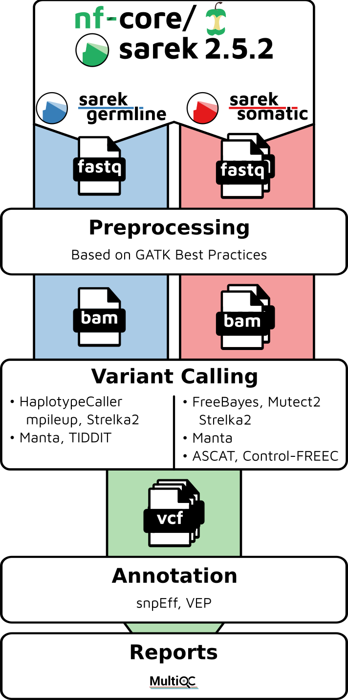
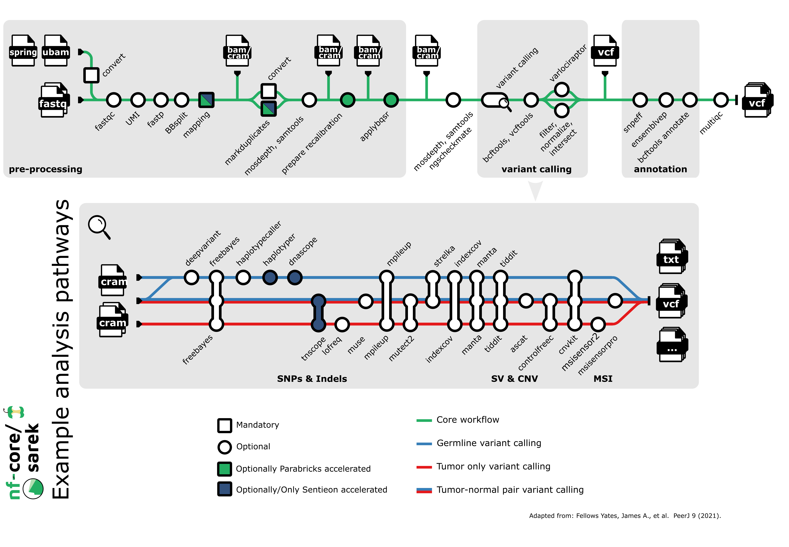

#  

> **An open-source analysis pipeline to detect germline or somatic variants from whole genome or targeted sequencing**

[](https://github.com/nf-core/sarek/actions?query=workflow%3A%22nf-core+CI%22)
[](https://github.com/nf-core/sarek/actions?query=workflow%3A%22nf-core+linting%22)
[](https://nf-co.re/sarek/results)
[](https://doi.org/10.5281/zenodo.3476425)

[](https://www.nextflow.io/)
[](https://docs.conda.io/en/latest/)
[](https://www.docker.com/)
[](https://sylabs.io/docs/)
[](https://tower.nf/launch?pipeline=https://github.com/nf-core/sarek)

[](https://nfcore.slack.com/channels/sarek)
[](https://twitter.com/nf_core)
[](https://www.youtube.com/c/nf-core)

## Introduction

**nf-core/sarek** is a workflow designed to detect variants on whole genome or targeted sequencing data. Initially designed for Human, and Mouse, it can work on any species with a reference genome. Sarek can also handle tumour / normal pairs and could include additional relapses.

The pipeline is built using [Nextflow](https://www.nextflow.io), a workflow tool to run tasks across multiple compute infrastructures in a very portable manner. It uses Docker/Singularity containers making installation trivial and results highly reproducible. The [Nextflow DSL2](https://www.nextflow.io/docs/latest/dsl2.html) implementation of this pipeline uses one container per process which makes it much easier to maintain and update software dependencies. Where possible, these processes have been submitted to and installed from [nf-core/modules](https://github.com/nf-core/modules) in order to make them available to all nf-core pipelines, and to everyone within the Nextflow community!

On release, automated continuous integration tests run the pipeline on a full-sized dataset on the AWS cloud infrastructure. This ensures that the pipeline runs on AWS, has sensible resource allocation defaults set to run on real-world datasets, and permits the persistent storage of results to benchmark between pipeline releases and other analysis sources. The results obtained from the full-sized test can be viewed on the [nf-core website](https://nf-co.re/sarek/results).

It's listed on [Elixir - Tools and Data Services Registry](https://bio.tools/nf-core-sarek) and [Dockstore](https://dockstore.org/workflows/github.com/nf-core/sarek).

<p align="center">
    
</p>

## Pipeline summary

By default, the pipeline currently performs the following:

- Sequencing quality control (`FastQC`)
- Map Reads to Reference (`BWA mem`)
- Mark Duplicates (`GATK MarkDuplicates`)
- Base (Quality Score) Recalibration (`GATK BaseRecalibrator`, `GATK ApplyBQSR`)
- Preprocessing quality control (`samtools stats`)
- Preprocessing quality control (`mosdepth`)
- Overall pipeline run summaries (`MultiQC`)

<p align="center">
    
</p>

## Quick Start

1. Install [`Nextflow`](https://www.nextflow.io/docs/latest/getstarted.html#installation) (`>=21.10.3`)

2. Install any of [`Docker`](https://docs.docker.com/engine/installation/), [`Singularity`](https://www.sylabs.io/guides/3.0/user-guide/) (you can follow [this tutorial](https://singularity-tutorial.github.io/01-installation/)), [`Podman`](https://podman.io/), [`Shifter`](https://nersc.gitlab.io/development/shifter/how-to-use/) or [`Charliecloud`](https://hpc.github.io/charliecloud/) for full pipeline reproducibility _(you can use [`Conda`](https://conda.io/miniconda.html) both to install Nextflow itself and also to manage software within pipelines. Please only use it within pipelines as a last resort; see [docs](https://nf-co.re/usage/configuration#basic-configuration-profiles))_.

3. Download the pipeline and test it on a minimal dataset with a single command:

   ```bash
   nextflow run nf-core/sarek -profile test,YOURPROFILE --outdir <OUTDIR>
   ```

   Note that some form of configuration will be needed so that Nextflow knows how to fetch the required software. This is usually done in the form of a config profile (`YOURPROFILE` in the example command above). You can chain multiple config profiles in a comma-separated string.

   > - The pipeline comes with config profiles called `docker`, `singularity`, `podman`, `shifter`, `charliecloud` and `conda` which instruct the pipeline to use the named tool for software management. For example, `-profile test,docker`.
   > - Please check [nf-core/configs](https://github.com/nf-core/configs#documentation) to see if a custom config file to run nf-core pipelines already exists for your Institute. If so, you can simply use `-profile <institute>` in your command. This will enable either `docker` or `singularity` and set the appropriate execution settings for your local compute environment.
   > - If you are using `singularity`, please use the [`nf-core download`](https://nf-co.re/tools/#downloading-pipelines-for-offline-use) command to download images first, before running the pipeline. Setting the [`NXF_SINGULARITY_CACHEDIR` or `singularity.cacheDir`](https://www.nextflow.io/docs/latest/singularity.html?#singularity-docker-hub) Nextflow options enables you to store and re-use the images from a central location for future pipeline runs.
   > - If you are using `conda`, it is highly recommended to use the [`NXF_CONDA_CACHEDIR` or `conda.cacheDir`](https://www.nextflow.io/docs/latest/conda.html) settings to store the environments in a central location for future pipeline runs.

4. Start running your own analysis!

   ```bash
   nextflow run nf-core/sarek --input samplesheet.csv --outdir <OUTDIR> --genome GATK.GRCh38 -profile <docker/singularity/podman/shifter/charliecloud/conda/institute>
   ```

See [usage docs](https://nf-co.re/sarek/usage) for all of the available options when running the pipeline.

## Documentation

The nf-core/sarek pipeline comes with documentation about the pipeline [usage](https://nf-co.re/sarek/usage), [parameters](https://nf-co.re/sarek/parameters) and [output](https://nf-co.re/sarek/output).

## Credits

Sarek was originally written by Maxime Garcia and Szilveszter Juhos at the [National Genomics Infastructure](https://ngisweden.scilifelab.se) and [National Bioinformatics Infastructure Sweden](https://nbis.se) which are both platforms at [SciLifeLab](https://scilifelab.se), with the support of [The Swedish Childhood Tumor Biobank (Barntumörbanken)](https://ki.se/forskning/barntumorbanken).
Friederike Hanssen and Gisela Gabernet at [QBiC](https://www.qbic.uni-tuebingen.de/) later joined and helped with further development.

Main authors:

- [Maxime Garcia](https://github.com/maxulysse)
- [Friederike Hanssen](https://github.com/FriederikeHanssen)
- [Szilveszter Juhos](https://github.com/szilvajuhos)

We thank the following people for their extensive assistance in the development of this pipeline:

- [Abhinav Sharma](https://github.com/abhi18av)
- [Adrian Lärkeryd](https://github.com/adrlar)
- [Alexander Peltzer](https://github.com/apeltzer)
- [Anders Sune Pedersen](https://github.com/asp8200)
- [Chela James](https://github.com/chelauk)
- [David Mas-Ponte](https://github.com/davidmasp)
- [Francesco Lescai](https://github.com/lescai)
- [Gavin Mackenzie](https://github.com/GCJMackenzie)
- [Gisela Gabernet](https://github.com/ggabernet)
- [Harshil Patel](https://github.com/drpatelh)
- [James A. Fellows Yates](https://github.com/jfy133)
- [Jesper Eisfeldt](https://github.com/J35P312)
- [Johannes Alneberg](https://github.com/alneberg)
- [José Fernández Navarro](https://github.com/jfnavarro)
- [Lasse Westergaard Folkersen](https://github.com/lassefolkersen)
- [Lucia Conde](https://github.com/lconde-ucl)
- [Malin Larsson](https://github.com/malinlarsson)
- [Marcel Martin](https://github.com/marcelm)
- [Nick Smith](https://github.com/nickhsmith)
- [Nilesh Tawari](https://github.com/nilesh-tawari)
- [Olga Botvinnik](https://github.com/olgabot)
- [Oskar Wacker](https://github.com/WackerO)
- [Paul Cantalupo](https://github.com/pcantalupo)
- [Phil Ewels](https://github.com/ewels)
- [Sabrina Krakau](https://github.com/skrakau)
- [Sebastian-D](https://github.com/Sebastian-D)
- [Silvia Morini](https://github.com/silviamorins)
- [Solenne Correard](https://github.com/scorreard)
- [Susanne Jodoin](https://github.com/SusiJo)
- [Tobias Koch](https://github.com/KochTobi)
- [Winni Kretzschmar](https://github.com/winni2k)
- [arontommi](https://github.com/arontommi)
- [BarryDigby](https://github.com/BarryDigby)
- [bjornnystedt](https://github.com/bjornnystedt)
- [cgpu](https://github.com/cgpu)
- [gulfshores](https://github.com/gulfshores)
- [pallolason](https://github.com/pallolason)

## Acknowledgements

|      [](https://ki.se/forskning/barntumorbanken)      |            [](https://scilifelab.se)             |
| :-----------------------------------------------------------------------------------------------: | :--------------------------------------------------------------------------------------------: |
| [](https://ngisweden.scilifelab.se/) | [](https://nbis.se) |
|              [](https://www.qbic.uni-tuebingen.de)              |                   [](https://www.ghga.de/)                   |
|                     [](https://eng.ngc.dk/)                     |                                                                                                |

## Contributions & Support

If you would like to contribute to this pipeline, please see the [contributing guidelines](.github/CONTRIBUTING.md).

For further information or help, don't hesitate to get in touch on the [Slack `#sarek` channel](https://nfcore.slack.com/channels/sarek) (you can join with [this invite](https://nf-co.re/join/slack)), or contact us: [Gisela Gabernet](mailto:gisela.gabernet@qbic.uni-tuebingen.de?subject=[GitHub]%20nf-core/sarek), [Maxime Garcia](mailto:maxime.garcia@scilifelab.se?subject=[GitHub]%20nf-core/sarek), [Friederike Hanssen](mailto:friederike.hanssen@qbic.uni-tuebingen.de?subject=[GitHub]%20nf-core/sarek), [Szilvester Juhos](mailto:szilveszter.juhos@scilifelab.se?subject=[GitHub]%20nf-core/sarek)

## Citations

If you use `nf-core/sarek` for your analysis, please cite the `Sarek` article as follows:

> Garcia M, Juhos S, Larsson M et al. **Sarek: A portable workflow for whole-genome sequencing analysis of germline and somatic variants [version 2; peer review: 2 approved]** _F1000Research_ 2020, 9:63 [doi: 10.12688/f1000research.16665.2](http://dx.doi.org/10.12688/f1000research.16665.2).

You can cite the sarek zenodo record for a specific version using the following [doi: 10.5281/zenodo.3476425](https://zenodo.org/badge/latestdoi/3476425)

An extensive list of references for the tools used by the pipeline can be found in the [`CITATIONS.md`](CITATIONS.md) file.

You can cite the `nf-core` publication as follows:

> **The nf-core framework for community-curated bioinformatics pipelines.**
>
> Philip Ewels, Alexander Peltzer, Sven Fillinger, Harshil Patel, Johannes Alneberg, Andreas Wilm, Maxime Ulysse Garcia, Paolo Di Tommaso & Sven Nahnsen.
>
> _Nat Biotechnol._ 2020 Feb 13. doi: [10.1038/s41587-020-0439-x](https://dx.doi.org/10.1038/s41587-020-0439-x).

## CHANGELOG

- [CHANGELOG](CHANGELOG.md)
