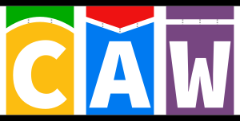

# Cancer Analysis Workflow
[![caw version][version-badge]][version-link] [![Licence][licence-badge]][licence-link] [![nextflow version][nextflow-badge]][nextflow-link] [![Join the chat at https://gitter.im/SciLifeLab/CAW][gitter-badge]][gitter-link]

CAW is a complete open source pipeline to detect somatic variants from WGS data: it is written in [Nextflow][nextflow-link], a domain specific language for workflow building.
We utilize [GATK best practices](https://software.broadinstitute.org/gatk/best-practices) to align, realign and recalibrate short-read data in parallel for both normal and tumor sample.
After these preprocessing steps, several somatic variant callers scan the resulting BAM files;
[MuTect1](https://github.com/broadinstitute/mutect), [MuTect2](https://github.com/broadgsa/gatk-protected) and [Strelka](https://github.com/Illumina/strelka) are used to find somatic SNVs and small indels,
also [GATK HaplotyeCaller](https://github.com/broadgsa/gatk-protected) for both the normal and the tumor sample.
For structural variants we use [Manta](https://github.com/Illumina/manta).
Furthermore, we are applying [ASCAT](https://github.com/Crick-CancerGenomics/ascat) to estimate sample heterogeneity, ploidy and CNVs.

The pipeline can begin the analysis either from raw FASTQ files, only from the realignment step, or directly with any subset of variant callers using recalibrated BAM files.
At the end of the analysis the resulting VCF files are merged to facilitate further downstream processing, though results from each caller are also retained.
The flow is capable of accommodating additional variant calling software or CNV callers.
It is also prepared to process normal, tumor and several relapse samples.

Besides variant calls, the workflow provides quality controls presented by [MultiQC](https://github.com/ewels/MultiQC/).

[Docker images](https://github.com/MaxUlysse/CAW-containers) are also available for easier deployment.

Cancer Analysis Workflow developed at the [National Genomics Infastructure](https://ngisweden.scilifelab.se/)
at [SciLifeLab Stockholm](https://www.scilifelab.se/platforms/ngi/), Sweden.

For further information/help contact: maxime.garcia@scilifelab.se or szilveszter.juhos@scilifelab.se, or join the gitter chat: [gitter.im/SciLifeLab/CAW][gitter-link]

## Installation and first execution
To use this pipeline, you need to have a working version of Nextflow installed.
- See the [Install Nextflow documentation](https://github.com/SciLifeLab/NGI-NextflowDocs/blob/master/docs/INSTALL.md)
- See the [first execution documentation](doc/FIRST_RUN.md)

## Usage
See the [usage documentation](doc/USAGE.md)

## Workflow processes
See the [processes documentation](doc/PROCESS.md)

## TSV files
See the [workflow TSV file documentation](doc/TSV.md)

## Use cases
See the [workflow use cases documentation](doc/USE_CASES.md)

## Tools and dependencies
- alleleCount 2.2.0
- bwa 0.7.8
- FastQC 0.11.5
- freebayes
- GATK 3.7
- gcc 4.9.2
- java jdk 7
- java jdk 8
- manta 1.0.0
- MultiQC 0.9
- MuTecT 1.1.5
- nextflow >= 0.22.1
- perl 5.18.4
- picard 2.0.1
- R 3.2.3
- samtools 1.3
- snpEff 4.2
- strelka 1.0.15

## Authors
- Sebastian DiLorenzo (@Sebastian-D)
- Jesper Eisfeldt (@J35P312)
- Maxime Garcia (@MaxUlysse)
- Szilveszter Juhos (@szilvajuhos)
- Max Käller (@gulfshores)
- Malin Larsson (@malinlarsson)
- Björn Nystedt (@bjornnystedt)
- Pall Olason (@pallolason)
- Pelin Sahlén (@pelinakan)

[gitter-badge]: https://badges.gitter.im/SciLifeLab/CAW.svg
[gitter-link]: https://gitter.im/SciLifeLab/CAW
[licence-badge]: https://img.shields.io/github/license/SciLifeLab/CAW.svg
[licence-link]: https://github.com/SciLifeLab/CAW/blob/master/LICENSE
[nextflow-badge]: https://img.shields.io/badge/nextflow-%E2%89%A50.22.2-brightgreen.svg
[nextflow-link]: https://www.nextflow.io/
[version-badge]: https://img.shields.io/github/release/SciLifeLab/CAW.svg
[version-link]: https://github.com/SciLifeLab/CAW/releases/latest
