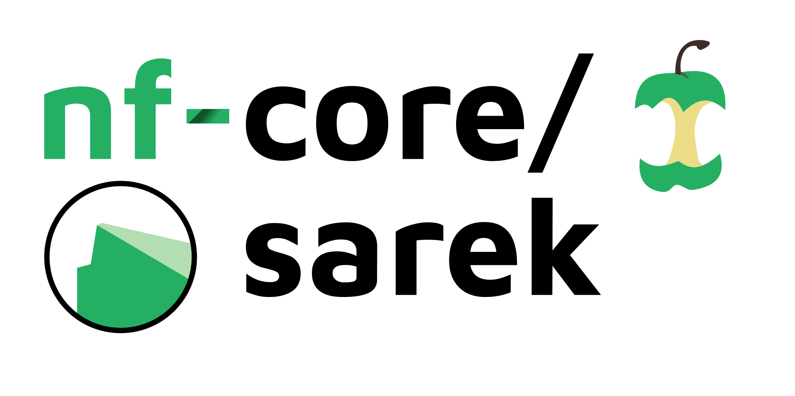
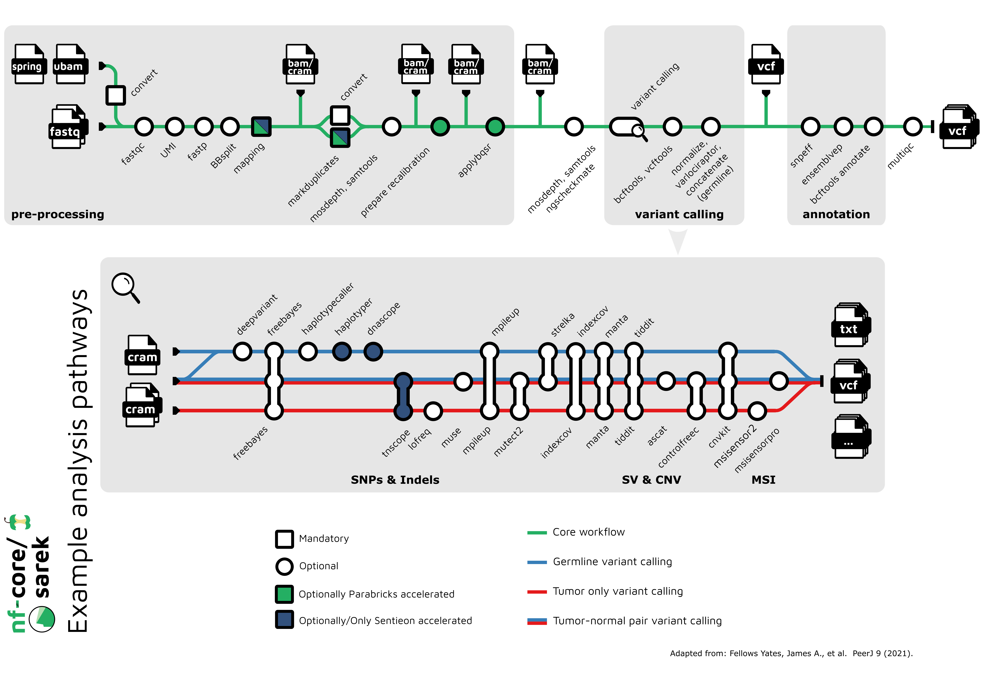

<h1>
  <picture>
    <source media="(prefers-color-scheme: dark)" srcset="docs/images/nf-core-sarek_logo_dark.png">
    
  </picture>
</h1>

[](https://github.com/nf-core/sarek/actions/workflows/ci.yml)
[](https://github.com/nf-core/sarek/actions/workflows/linting.yml)
[](https://nf-co.re/sarek/results)
[](https://www.nf-test.com)
[](https://doi.org/10.5281/zenodo.3476425)
[](https://www.nf-test.com)

[](https://www.nextflow.io/)
[](https://docs.conda.io/en/latest/)
[](https://www.docker.com/)
[](https://sylabs.io/docs/)
[](https://cloud.seqera.io/launch?pipeline=https://github.com/nf-core/sarek)

[](https://nfcore.slack.com/channels/sarek)
[](https://twitter.com/nf_core)
[](https://mstdn.science/@nf_core)
[](https://www.youtube.com/c/nf-core)

## Introduction

**nf-core/sarek** is a workflow designed to detect variants on whole genome or targeted sequencing data. Initially designed for Human, and Mouse, it can work on any species with a reference genome. Sarek can also handle tumour / normal pairs and could include additional relapses.

The pipeline is built using [Nextflow](https://www.nextflow.io), a workflow tool to run tasks across multiple compute infrastructures in a very portable manner. It uses Docker/Singularity containers making installation trivial and results highly reproducible. The [Nextflow DSL2](https://www.nextflow.io/docs/latest/dsl2.html) implementation of this pipeline uses one container per process which makes it much easier to maintain and update software dependencies. Where possible, these processes have been submitted to and installed from [nf-core/modules](https://github.com/nf-core/modules) in order to make them available to all nf-core pipelines, and to everyone within the Nextflow community!

On release, automated continuous integration tests run the pipeline on a full-sized dataset on the AWS cloud infrastructure. This ensures that the pipeline runs on AWS, has sensible resource allocation defaults set to run on real-world datasets, and permits the persistent storage of results to benchmark between pipeline releases and other analysis sources. The results obtained from the full-sized test can be viewed on the [nf-core website](https://nf-co.re/sarek/results).

It's listed on [Elixir - Tools and Data Services Registry](https://bio.tools/nf-core-sarek) and [Dockstore](https://dockstore.org/workflows/github.com/nf-core/sarek).

<p align="center">
    
</p>

## Pipeline summary

Depending on the options and samples provided, the pipeline can currently perform the following:

- Form consensus reads from UMI sequences (`fgbio`)
- Sequencing quality control and trimming (enabled by `--trim_fastq`) (`FastQC`, `fastp`)
- Map Reads to Reference (`BWA-mem`, `BWA-mem2`, `dragmap` or `Sentieon BWA-mem`)
- Process BAM file (`GATK MarkDuplicates`, `GATK BaseRecalibrator` and `GATK ApplyBQSR` or `Sentieon LocusCollector` and `Sentieon Dedup`)
- Summarise alignment statistics (`samtools stats`, `mosdepth`)
- Variant calling (enabled by `--tools`, see [compatibility](https://nf-co.re/sarek/latest/docs/usage#which-variant-calling-tool-is-implemented-for-which-data-type)):
  - `ASCAT`
  - `CNVkit`
  - `Control-FREEC`
  - `DeepVariant`
  - `freebayes`
  - `GATK HaplotypeCaller`
  - `Manta`
  - `indexcov`
  - `mpileup`
  - `MSIsensor-pro`
  - `Mutect2`
  - `Sentieon Haplotyper`
  - `Strelka2`
  - `TIDDIT`
  - `Lofreq`
- Variant filtering and annotation (`SnpEff`, `Ensembl VEP`, `BCFtools annotate`)
- Summarise and represent QC (`MultiQC`)

<p align="center">
    
</p>

## Usage

> [!NOTE]
> If you are new to Nextflow and nf-core, please refer to [this page](https://nf-co.re/docs/usage/installation) on how to set-up Nextflow. Make sure to [test your setup](https://nf-co.re/docs/usage/introduction#how-to-run-a-pipeline) with `-profile test` before running the workflow on actual data.

First, prepare a samplesheet with your input data that looks as follows:

`samplesheet.csv`:

```csv
patient,sample,lane,fastq_1,fastq_2
ID1,S1,L002,ID1_S1_L002_R1_001.fastq.gz,ID1_S1_L002_R2_001.fastq.gz
```

Each row represents a pair of fastq files (paired end).

Now, you can run the pipeline using:

```bash
nextflow run nf-core/sarek \
   -profile <docker/singularity/.../institute> \
   --input samplesheet.csv \
   --outdir <OUTDIR>
```

> [!WARNING]
> Please provide pipeline parameters via the CLI or Nextflow `-params-file` option. Custom config files including those provided by the `-c` Nextflow option can be used to provide any configuration _**except for parameters**_; see [docs](https://nf-co.re/docs/usage/getting_started/configuration#custom-configuration-files).

For more details and further functionality, please refer to the [usage documentation](https://nf-co.re/sarek/usage) and the [parameter documentation](https://nf-co.re/sarek/parameters).

## Pipeline output

To see the results of an example test run with a full size dataset refer to the [results](https://nf-co.re/sarek/results) tab on the nf-core website pipeline page.
For more details about the output files and reports, please refer to the
[output documentation](https://nf-co.re/sarek/output).

## Benchmarking

On each release, the pipeline is run on 3 full size tests:

- `test_full` runs tumor-normal data for one patient from the SEQ2C consortium
- `test_full_germline` runs a WGS 30X Genome-in-a-Bottle(NA12878) dataset
- `test_full_germline_ncbench_agilent` runs two WES samples with 75M and 200M reads (data available [here](https://github.com/ncbench/ncbench-workflow#contributing-callsets)). The results are uploaded to Zenodo, evaluated against a truth dataset, and results are made available via the [NCBench dashboard](https://ncbench.github.io/report/report.html#).

## Credits

Sarek was originally written by Maxime U Garcia and Szilveszter Juhos at the [National Genomics Infastructure](https://ngisweden.scilifelab.se) and [National Bioinformatics Infastructure Sweden](https://nbis.se) which are both platforms at [SciLifeLab](https://scilifelab.se), with the support of [The Swedish Childhood Tumor Biobank (Barntumörbanken)](https://ki.se/forskning/barntumorbanken).
Friederike Hanssen and Gisela Gabernet at [QBiC](https://www.qbic.uni-tuebingen.de/) later joined and helped with further development.

The Nextflow DSL2 conversion of the pipeline was lead by Friederike Hanssen and Maxime U Garcia.

Maintenance is now lead by Friederike Hanssen and Maxime U Garcia (now at [Seqera Labs](https://seqera/io))

Main developers:

- [Maxime U Garcia](https://github.com/maxulysse)
- [Friederike Hanssen](https://github.com/FriederikeHanssen)

We thank the following people for their extensive assistance in the development of this pipeline:

- [Abhinav Sharma](https://github.com/abhi18av)
- [Adam Talbot](https://github.com/adamrtalbot)
- [Adrian Lärkeryd](https://github.com/adrlar)
- [Àitor Olivares](https://github.com/AitorPeseta)
- [Alexander Peltzer](https://github.com/apeltzer)
- [Alison Meynert](https://github.com/ameynert)
- [Anders Sune Pedersen](https://github.com/asp8200)
- [arontommi](https://github.com/arontommi)
- [BarryDigby](https://github.com/BarryDigby)
- [Bekir Ergüner](https://github.com/berguner)
- [bjornnystedt](https://github.com/bjornnystedt)
- [cgpu](https://github.com/cgpu)
- [Chela James](https://github.com/chelauk)
- [David Mas-Ponte](https://github.com/davidmasp)
- [Edmund Miller](https://github.com/edmundmiller)
- [Famke Bäuerle](https://github.com/famosab)
- [Francesco Lescai](https://github.com/lescai)
- [Francisco Martínez](https://github.com/nevinwu)
- [Gavin Mackenzie](https://github.com/GCJMackenzie)
- [Gisela Gabernet](https://github.com/ggabernet)
- [Grant Neilson](https://github.com/grantn5)
- [gulfshores](https://github.com/gulfshores)
- [Harshil Patel](https://github.com/drpatelh)
- [Hongwei Ye](https://github.com/YeHW)
- [James A. Fellows Yates](https://github.com/jfy133)
- [Jesper Eisfeldt](https://github.com/J35P312)
- [Johannes Alneberg](https://github.com/alneberg)
- [José Fernández Navarro](https://github.com/jfnavarro)
- [Júlia Mir Pedrol](https://github.com/mirpedrol)
- [Ken Brewer](https://github.com/kenibrewer)
- [Lasse Westergaard Folkersen](https://github.com/lassefolkersen)
- [Lucia Conde](https://github.com/lconde-ucl)
- [Malin Larsson](https://github.com/malinlarsson)
- [Marcel Martin](https://github.com/marcelm)
- [Nick Smith](https://github.com/nickhsmith)
- [Nicolas Schcolnicov](https://github.com/nschcolnicov)
- [Nilesh Tawari](https://github.com/nilesh-tawari)
- [Nils Homer](https://github.com/nh13)
- [Olga Botvinnik](https://github.com/olgabot)
- [Oskar Wacker](https://github.com/WackerO)
- [pallolason](https://github.com/pallolason)
- [Paul Cantalupo](https://github.com/pcantalupo)
- [Phil Ewels](https://github.com/ewels)
- [Pierre Lindenbaum](https://github.com/lindenb)
- [Sabrina Krakau](https://github.com/skrakau)
- [Sam Minot](https://github.com/sminot)
- [Sebastian-D](https://github.com/Sebastian-D)
- [Silvia Morini](https://github.com/silviamorins)
- [Simon Pearce](https://github.com/SPPearce)
- [Solenne Correard](https://github.com/scorreard)
- [Susanne Jodoin](https://github.com/SusiJo)
- [Szilveszter Juhos](https://github.com/szilvajuhos)
- [Tobias Koch](https://github.com/KochTobi)
- [Winni Kretzschmar](https://github.com/winni2k)

## Acknowledgements

|      [](https://ki.se/forskning/barntumorbanken)      |            [](https://scilifelab.se)             |
| :-----------------------------------------------------------------------------------------------: | :--------------------------------------------------------------------------------------------: |
| [](https://ngisweden.scilifelab.se/) | [](https://nbis.se) |
|              [](https://www.qbic.uni-tuebingen.de)              |                   [](https://www.ghga.de/)                   |
|                     [](https://eng.ngc.dk/)                     |                                                                                                |

## Contributions & Support

If you would like to contribute to this pipeline, please see the [contributing guidelines](.github/CONTRIBUTING.md).

For further information or help, don't hesitate to get in touch on the [Slack `#sarek` channel](https://nfcore.slack.com/channels/sarek) (you can join with [this invite](https://nf-co.re/join/slack)), or contact us: [Maxime U Garcia](mailto:maxime.garcia@seqera.io?subject=[GitHub]%20nf-core/sarek), [Friederike Hanssen](mailto:friederike.hanssen@qbic.uni-tuebingen.de?subject=[GitHub]%20nf-core/sarek)

## Citations

If you use `nf-core/sarek` for your analysis, please cite the `Sarek` article as follows:

> Friederike Hanssen, Maxime U Garcia, Lasse Folkersen, Anders Sune Pedersen, Francesco Lescai, Susanne Jodoin, Edmund Miller, Oskar Wacker, Nicholas Smith, nf-core community, Gisela Gabernet, Sven Nahnsen **Scalable and efficient DNA sequencing analysis on different compute infrastructures aiding variant discovery** _NAR Genomics and Bioinformatics_ Volume 6, Issue 2, June 2024, lqae031, [doi: 10.1093/nargab/lqae031](https://doi.org/10.1093/nargab/lqae031).

> Garcia M, Juhos S, Larsson M et al. **Sarek: A portable workflow for whole-genome sequencing analysis of germline and somatic variants [version 2; peer review: 2 approved]** _F1000Research_ 2020, 9:63 [doi: 10.12688/f1000research.16665.2](http://dx.doi.org/10.12688/f1000research.16665.2).

You can cite the sarek zenodo record for a specific version using the following [doi: 10.5281/zenodo.3476425](https://doi.org/10.5281/zenodo.3476425)

An extensive list of references for the tools used by the pipeline can be found in the [`CITATIONS.md`](CITATIONS.md) file.

You can cite the `nf-core` publication as follows:

> **The nf-core framework for community-curated bioinformatics pipelines.**
>
> Philip Ewels, Alexander Peltzer, Sven Fillinger, Harshil Patel, Johannes Alneberg, Andreas Wilm, Maxime Ulysse Garcia, Paolo Di Tommaso & Sven Nahnsen.
>
> _Nat Biotechnol._ 2020 Feb 13. doi: [10.1038/s41587-020-0439-x](https://dx.doi.org/10.1038/s41587-020-0439-x).

## CHANGELOG

- [CHANGELOG](CHANGELOG.md)
