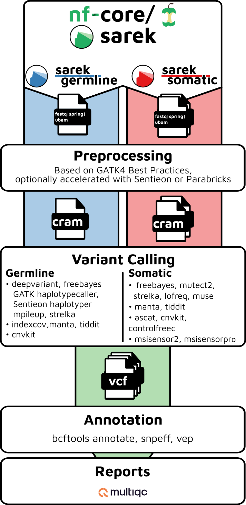

# [](https://nf-co.re/sarek)

> **An open-source analysis pipeline to detect germline or somatic variants from whole genome or targeted sequencing**
[](https://www.nextflow.io/)
[](https://nf-co.re/)
[](https://zenodo.org/badge/latestdoi/184289291)

[](https://github.com/nf-core/sarek/actions?query=workflow%3A%22nf-core+CI%22)
[](https://github.com/nf-core/sarek/actions?query=workflow%3A%22nf-core+linting%22)
[](https://circleci.com/gh/nf-core/sarek/)

[](http://bioconda.github.io/)
[](https://hub.docker.com/r/nfcore/sarek/)
[](https://www.sylabs.io/docs/)

[](https://nfcore.slack.com/channels/sarek)

## Introduction

Sarek is a workflow designed to run analyses on whole genome or targeted sequencing data from regular samples or tumour / normal pairs and could include additional relapses.

It's built using [Nextflow](https://www.nextflow.io), a workflow tool to run tasks across multiple compute infrastructures in a very portable manner.
It comes with docker containers making installation trivial and results highly reproducible.

<p align="center">
    
</p>

It's listed on [Elixir - Tools and Data Services Registry](https://bio.tools/Sarek) and [Dockstore](https://dockstore.org/workflows/github.com/nf-core/sarek).

## Quick Start

i. Install [`Nextflow`](https://nf-co.re/usage/installation)

ii. Install either [`Docker`](https://docs.docker.com/engine/installation/) or [`Singularity`](https://www.sylabs.io/guides/3.0/user-guide/) for full pipeline reproducibility (please only use [`Conda`](https://conda.io/miniconda.html) as a last resort; see [docs](https://nf-co.re/usage/configuration#basic-configuration-profiles))

iii. Download the pipeline and test it on a minimal dataset with a single command

```bash
nextflow run nf-core/sarek -profile test,<docker/singularity/conda/institute>
```

> Please check [nf-core/configs](https://github.com/nf-core/configs#documentation) to see if a custom config file to run nf-core pipelines already exists for your Institute.
> If so, you can simply use `-profile <institute>` in your command.
> This will enable either `docker` or `singularity` and set the appropriate execution settings for your local compute environment.

iv. Start running your own analysis!

```bash
nextflow run nf-core/sarek -profile <docker/singularity/conda/institute> --input '*.tsv' --genome GRCh38
```

See [usage docs](docs/usage.md) for all of the available options when running the pipeline.

## Documentation

The nf-core/sarek pipeline comes with documentation about the pipeline, found in the `docs/` directory:

1. [Installation](https://nf-co.re/usage/installation)
2. Pipeline configuration
    * [Local installation](https://nf-co.re/usage/local_installation)
    * [Adding your own system config](https://nf-co.re/usage/adding_own_config)
    * [Install on a secure cluster](docs/install_bianca.md)
    * [Reference genomes](https://nf-co.re/usage/reference_genomes)
    * [Extra documentation on reference](docs/reference.md)
3. [Running the pipeline](docs/usage.md)
    * [Examples](docs/use_cases.md)
    * [Input files documentation](docs/input.md)
    * [Documentation about containers](docs/containers.md)
4. [Output and how to interpret the results](docs/output.md)
    * [Complementary information about ASCAT](docs/ascat.md)
    * [Extra documentation on annotation](docs/annotation.md)
5. [Troubleshooting](https://nf-co.re/usage/troubleshooting)

## Credits

Sarek was developed at the [National Genomics Infastructure](https://ngisweden.scilifelab.se) and [National Bioinformatics Infastructure Sweden](https://nbis.se) which are both platforms at [SciLifeLab](https://scilifelab.se), with the support of [The Swedish Childhood Tumor Biobank (Barntumörbanken)](https://ki.se/forskning/barntumorbanken).

Main authors:

* [Maxime Garcia](https://github.com/MaxUlysse)
* [Szilveszter Juhos](https://github.com/szilvajuhos)

Helpful contributors:

* [Adrian Lärkeryd](https://github.com/adrlar)
* [Alexander Peltzer](https://github.com/apeltzer)
* [Chela James](https://github.com/chelauk)
* [David Mas-Ponte](https://github.com/davidmasp)
* [Francesco L](https://github.com/nibscles)
* [Friederike Hanssen](https://github.com/FriederikeHanssen)
* [Gisela Gabernet](https://github.com/ggabernet)
* [Jesper Eisfeldt](https://github.com/J35P312)
* [Johannes Alneberg](https://github.com/alneberg)
* [Tobias Koch](https://github.com/KochTobi)
* [Lucia Conde](https://github.com/lconde-ucl)
* [Malin Larsson](https://github.com/malinlarsson)
* [Marcel Martin](https://github.com/marcelm)
* [Nilesh Tawari](https://github.com/nilesh-tawari)
* [Phil Ewels](https://github.com/ewels)
* [Sabrina Krakau](https://github.com/skrakau)
* [Sebastian-D](https://github.com/Sebastian-D)
* [Winni Kretzschmar](https://github.com/winni2k)
* [arontommi](https://github.com/arontommi)
* [bjornnystedt](https://github.com/bjornnystedt)
* [cgpu](https://github.com/cgpu)
* [gulfshores](https://github.com/gulfshores)
* [pallolason](https://github.com/pallolason)
* [silviamorins](https://github.com/silviamorins)

## Contributions & Support

If you would like to contribute to this pipeline, please see the [contributing guidelines](.github/CONTRIBUTING.md).

For further information or help, don't hesitate to get in touch on [Slack](https://nfcore.slack.com/channels/sarek) (you can join with [this invite](https://nf-co.re/join/slack)) or contact us: maxime.garcia@scilifelab.se, szilveszter.juhos@scilifelab.se

## CHANGELOG

* [CHANGELOG](CHANGELOG.md)

## Acknowledgements

[](https://ki.se/forskning/barntumorbanken) | [](https://scilifelab.se)
:-:|:-:
[](https://ngisweden.scilifelab.se/) | [](https://nbis.se)

## Citation

If you use `nf-core/sarek` for your analysis, please cite the `Sarek` article as follows:
> Garcia M, Juhos S, Larsson M et al. **Sarek: A portable workflow for whole-genome sequencing analysis of germline and somatic variants [version 1; peer review: 2 approved]** *F1000Research* 2020, 9:63 [doi: 10.12688/f1000research.16665.1](https://f1000research.com/articles/9-63/v1).

You can cite the sarek zenodo record for a specific version using the following [doi: 10.5281/zenodo.3476426](https://zenodo.org/badge/latestdoi/184289291)

You can cite the `nf-core` publication as follows:

> **The nf-core framework for community-curated bioinformatics pipelines.**
>
> Philip Ewels, Alexander Peltzer, Sven Fillinger, Harshil Patel, Johannes Alneberg, Andreas Wilm, Maxime Ulysse Garcia, Paolo Di Tommaso & Sven Nahnsen.
>
> _Nat Biotechnol._ 2020 Feb 13. doi: [10.1038/s41587-020-0439-x](https://dx.doi.org/10.1038/s41587-020-0439-x).  
> ReadCube: [Full Access Link](https://rdcu.be/b1GjZ)
